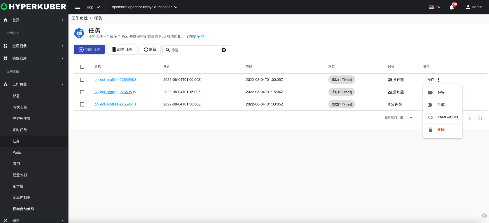
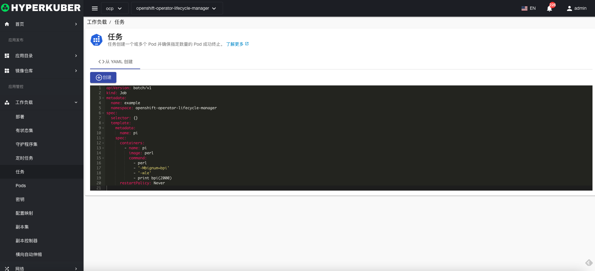
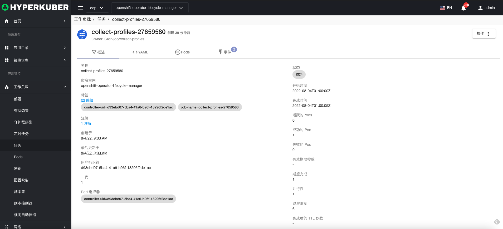
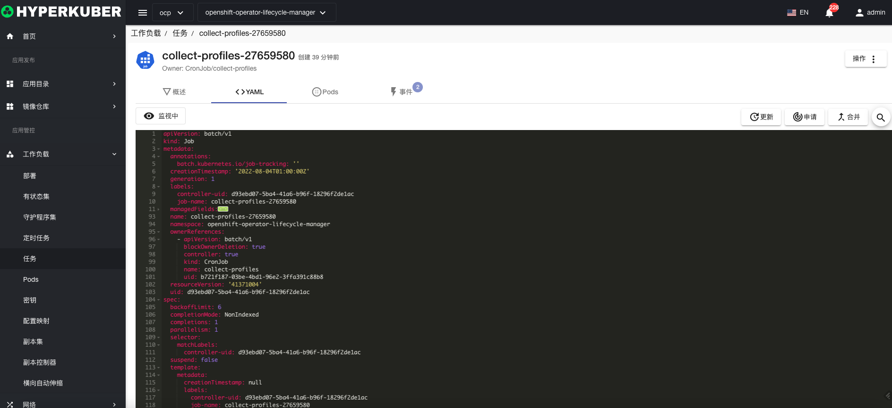
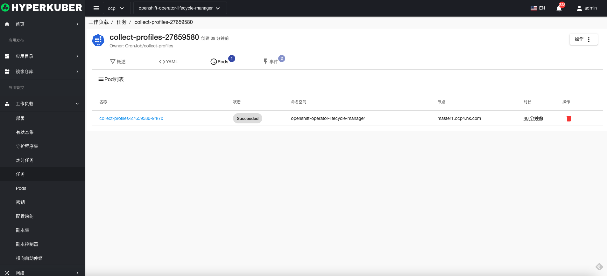
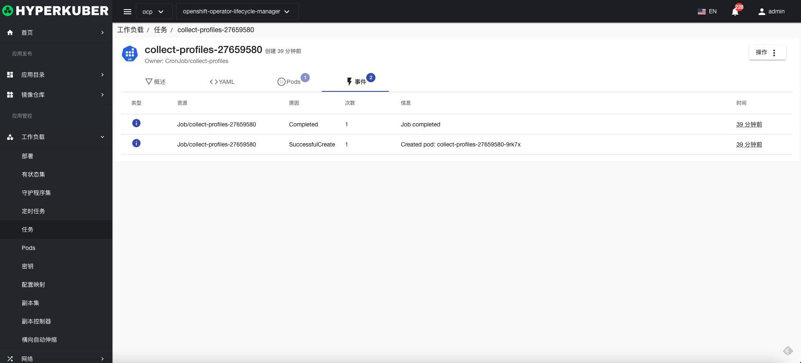

# 任务

Job任务创建一个或多个 Pod 并确保指定数量的 Pod 成功终止。

## 任务操作

支持以下界面图形化操作：

* 标签
* 注解
* Yaml/Json编辑

### Yaml创建
任务可通过Yaml文件直接创建

### 任务详情
点击任务名称的链接，即可进入任务的详情页面
概览信息

Yaml信息

容器信息

事件信息

### 删除
选择需要删除的任务，点击多选框选择，点击“删除按钮”，在确定输入框输入“yes”，即可完成删除操作。
### 刷新
点击“刷新”，即可完成任务列表的刷新。

