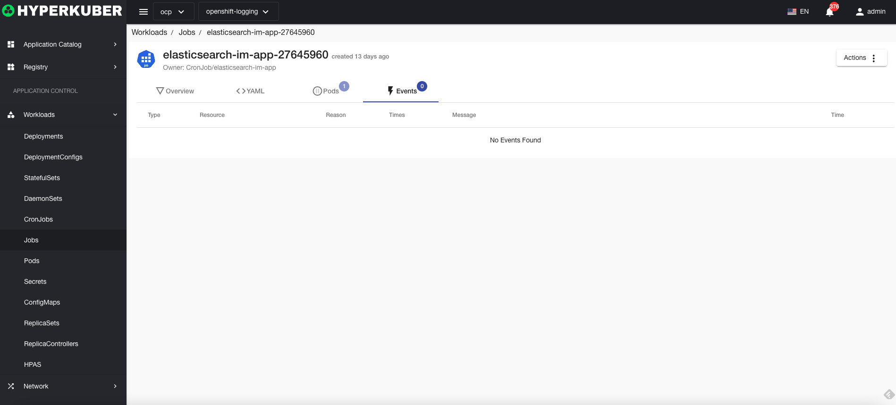

# Task

A Job task creates one or more Pods and ensures that the specified number of Pods terminate successfully.

## task operation

The following interface graphical operations are supported:

* Label
* Notes
* Yaml/Json editing

### Yaml create
Tasks can be created directly from Yaml files

### Mission Details
Click the link of the task name to enter the task details page
Overview information

Yaml information

container information

event information

### delete
Select the task to be deleted, click the multi-select box to select, click the "Delete button", and enter "yes" in the confirmation input box to complete the deletion operation.
### refresh
Click "Refresh" to complete the refresh of the task list.