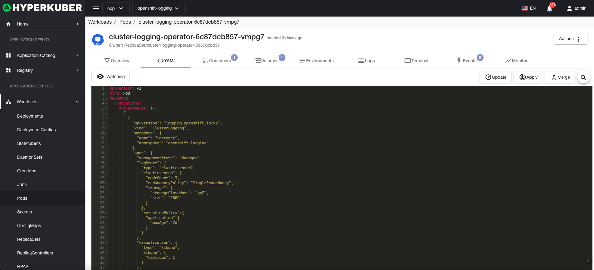

# Pod

A Pod is the smallest deployable unit of computing that can be created and managed in Kubernetes.

## Pod operations

The following interface graphical operations are supported:
* Debug Pod
* Service public
* Image upgrade
* Tolerate
* Label
* Notes
* Yaml/Json editing

### Status selection
Pod supports the following state selections

### Command Line
Pod clicks the "Command Line" button, and the "Command Line" window pops up, and you can execute shell commands in the "Command Line" window

### log
Pod clicks the "Log" button to view the Container log in the Pod

### Create
Create a Pod, click the "Create Pod" button, enter the Create Pod page, and fill in the necessary parameters

parameter
Name: Pod name

parameter
Image name: Pod image name
Mirror address: Pod mirror warehouse address
Exposed port: Service exposed port

Optional parameters:
Pod Security
Pod network
other
Click "Create" to do so.

### Yaml create
Pods can be created directly from Yaml files

### Pod Details
Click the link of the Pod name to enter the details page of the Pod
Overview information

Yaml information

container information

Storage volume information

Environmental information

log

terminal

event information

Pod monitoring information

### delete
Select the Pod to be deleted, click the multi-select box to select, click the "Delete button", and enter "yes" in the confirmation input box to complete the deletion operation.
### refresh
Click "Refresh" to complete the refresh of the Pod list.