# Pod

Pod 是可在 Kubernetes 中创建和管理的最小可部署计算单元。
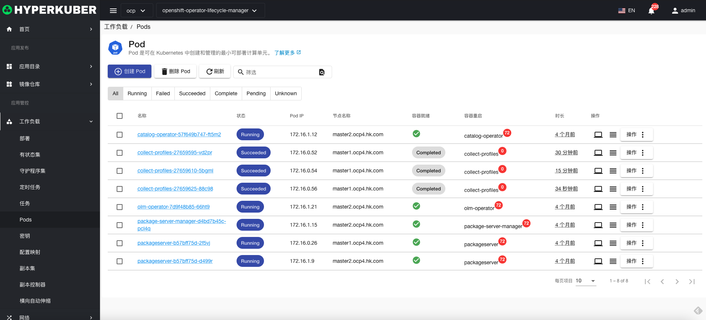
## Pod操作

支持以下界面图形化操作：
* 调试Pod
* 服务公开
* 镜像升级
* 容忍
* 标签
* 注解
* Yaml/Json编辑

### 状态选择
Pod支持以下状态选择

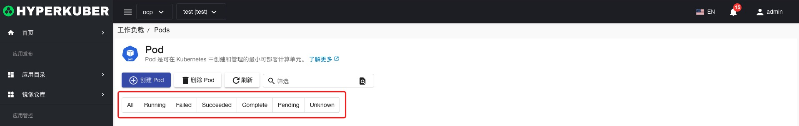

### 命令行
Pod点击“命令行”按钮，弹出“命令行”窗口，可以在“命令行”窗口执行shell命令
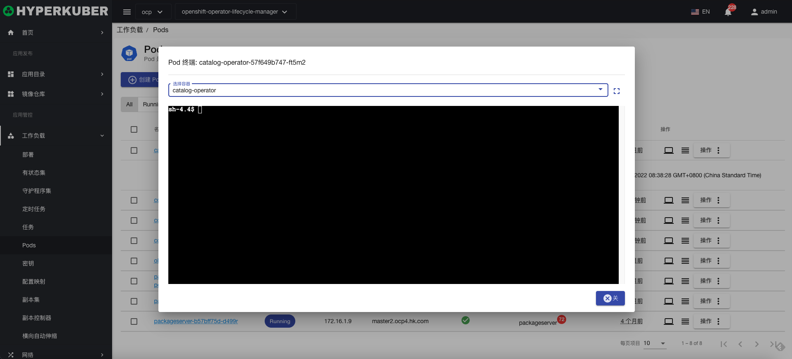

### 日志
Pod点击“日志”按钮，可以查看Pod中Container日志
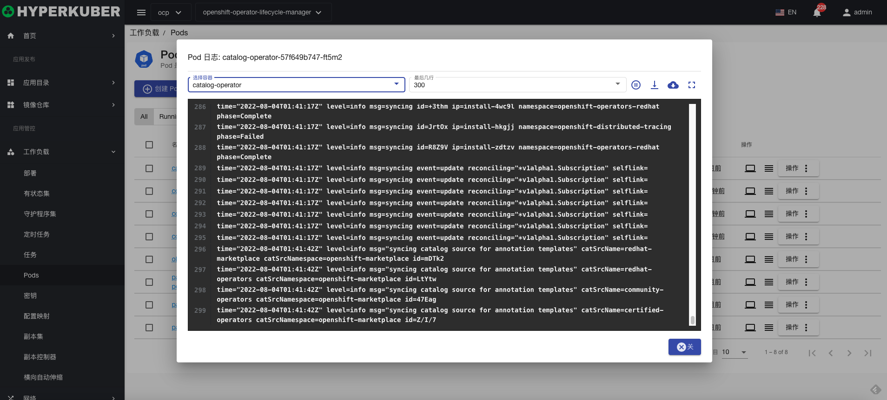

### 创建
创建Pod，点击“创建Pod”按钮，进入创建Pod页面，填写必要参数
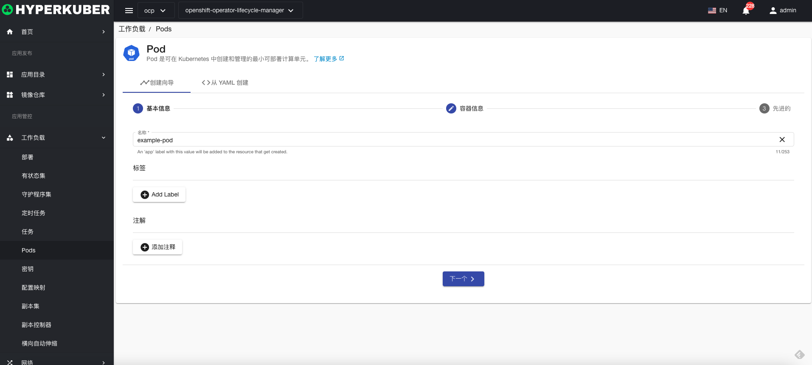
参数
名称：Pod名称

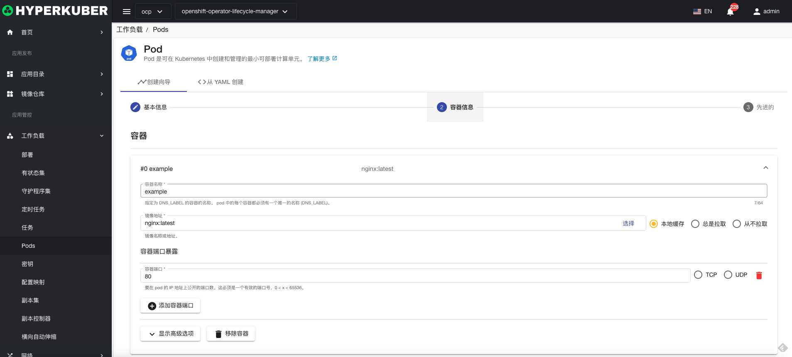
参数
镜像名称：Pod镜像名称
镜像地址：Pod镜像仓库地址
暴露端口：服务暴露端口
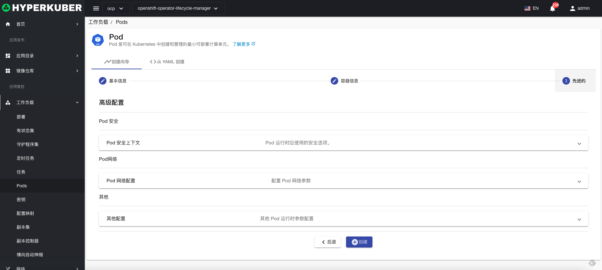
非必填参数：
Pod安全
Pod网络
其他
点击“创建”即可。

### Yaml创建
Pod可通过Yaml文件直接创建
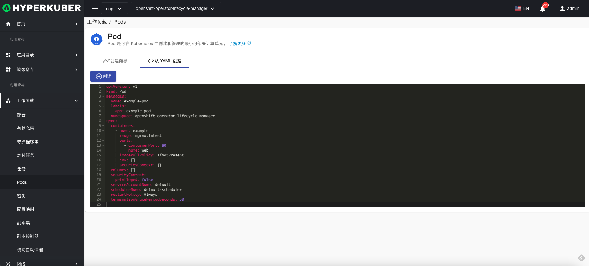
### Pod详情
点击Pod名称的链接，即可进入Pod的详情页面
概览信息
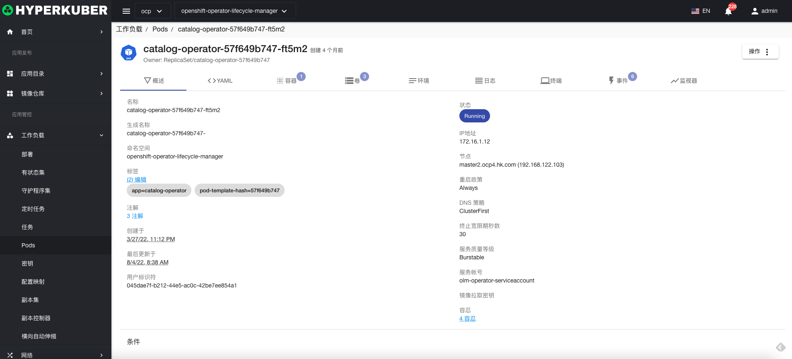

Yaml信息
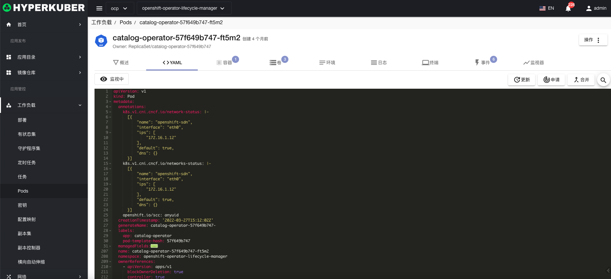
容器信息
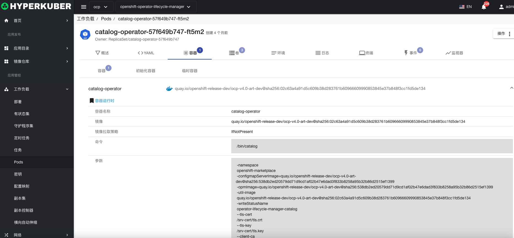
存储卷信息
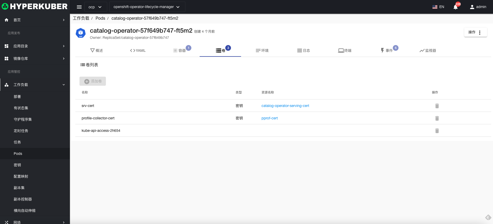
环境信息
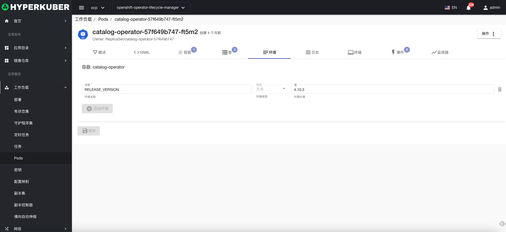
日志
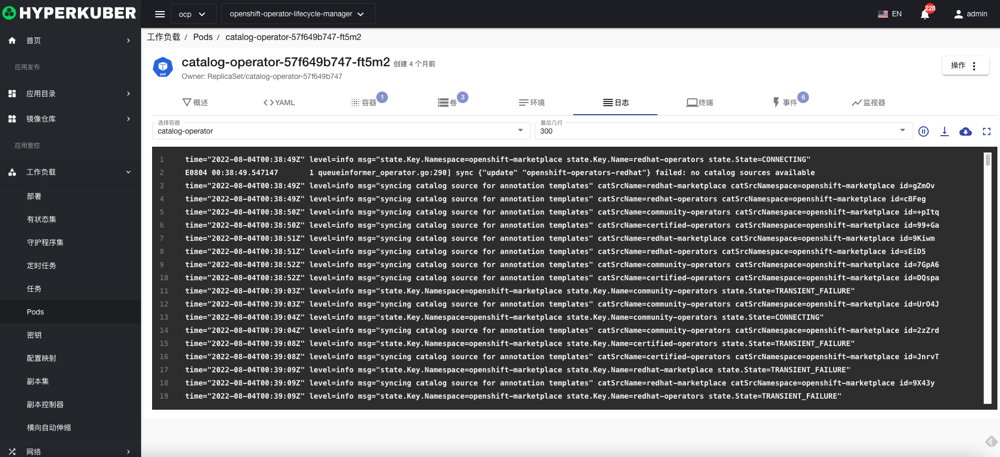
终端
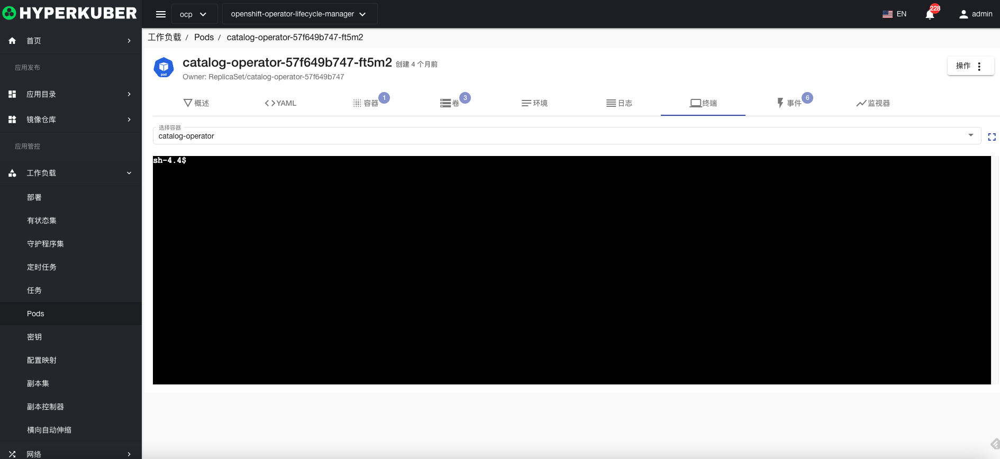
事件信息
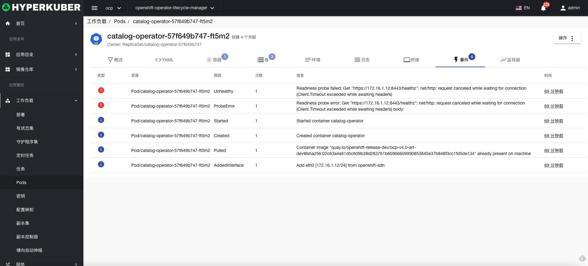
Pod监控信息
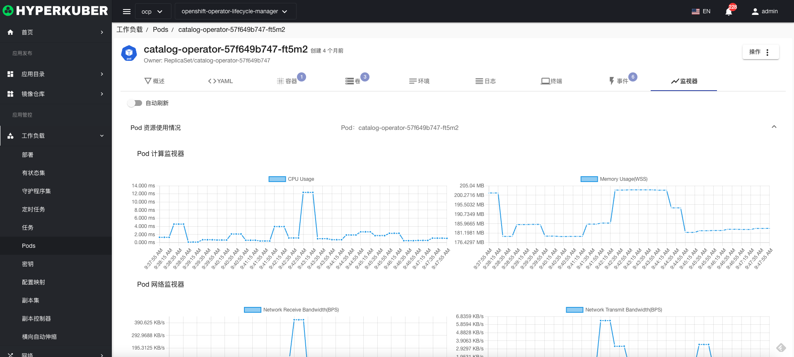
### 删除
选择需要删除的Pod，点击多选框选择，点击“删除按钮”，在确定输入框输入“yes”，即可完成删除操作。
### 刷新
点击“刷新”，即可完成Pod列表的刷新。

