# replica controller

The replica controller ensures that the specified number of pod replicas are running at all times.
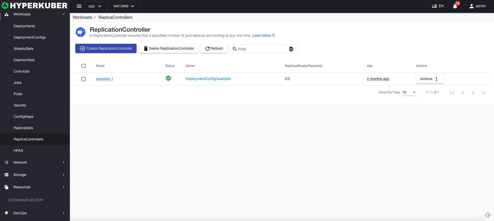
## replica controller action

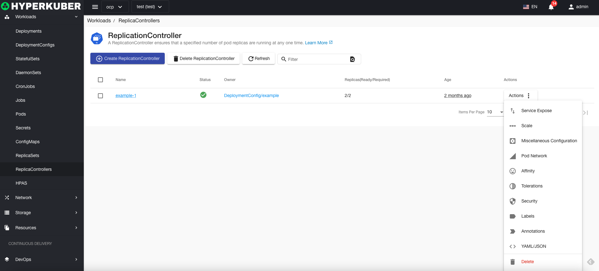
The following interface graphical operations are supported:
* Service public
* Expansion
* other configuration
* pod network
* Affinity
* Tolerate
* Strategy
* Safety
* Label
* Notes
* Yaml/Json editing

### Create
Create a replica controller, click the "Create a replica controller" button, enter the create replica controller page, and fill in the necessary parameters
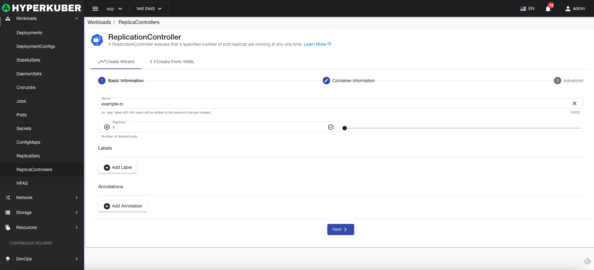
parameter
name: replica controller name

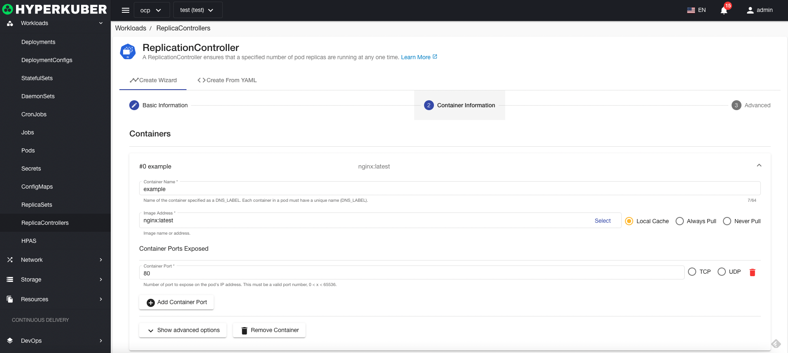
parameter
Image name: Replica controller image name
Mirror address: the mirror warehouse address of the replica controller
Exposed port: The replica controller service exposes the port
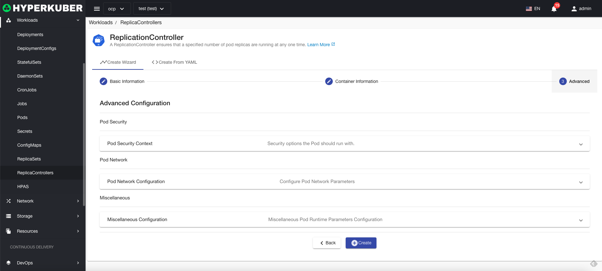
Optional parameters:
Pod Security
Pod network
other
Click "Create" to do so.

### Yaml create
Replica controllers can be created directly from Yaml files
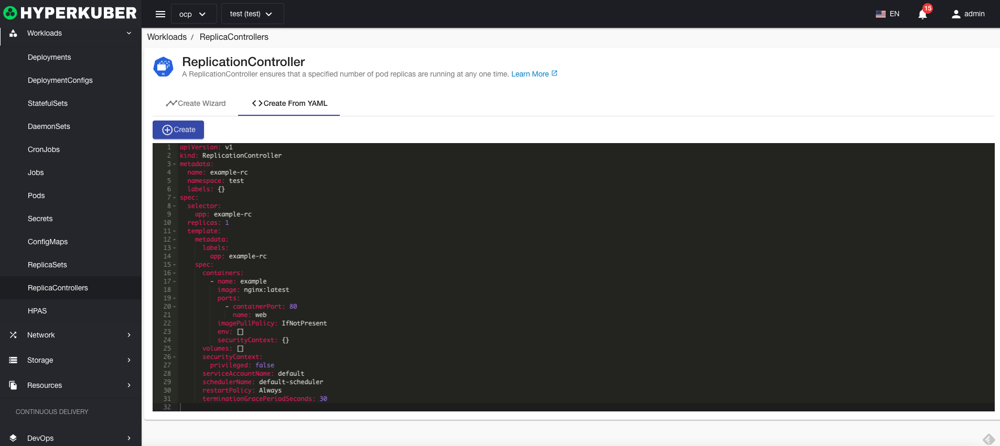
### Replica Controller Details
Click the link of the replica controller name to enter the details page of the replica controller
Overview information
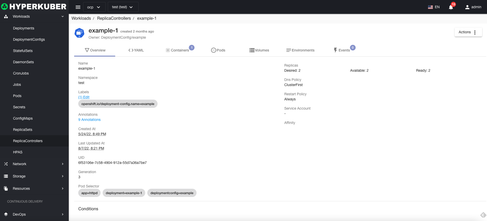

Yaml information
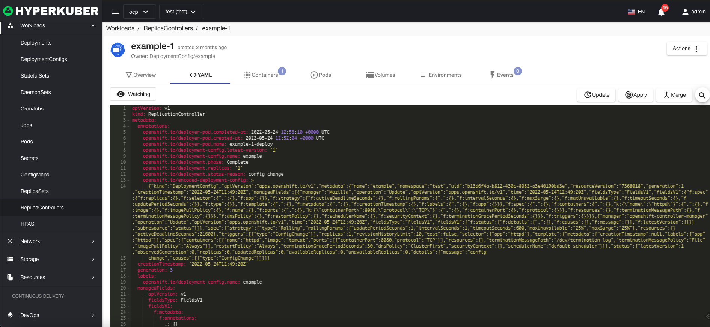
container information
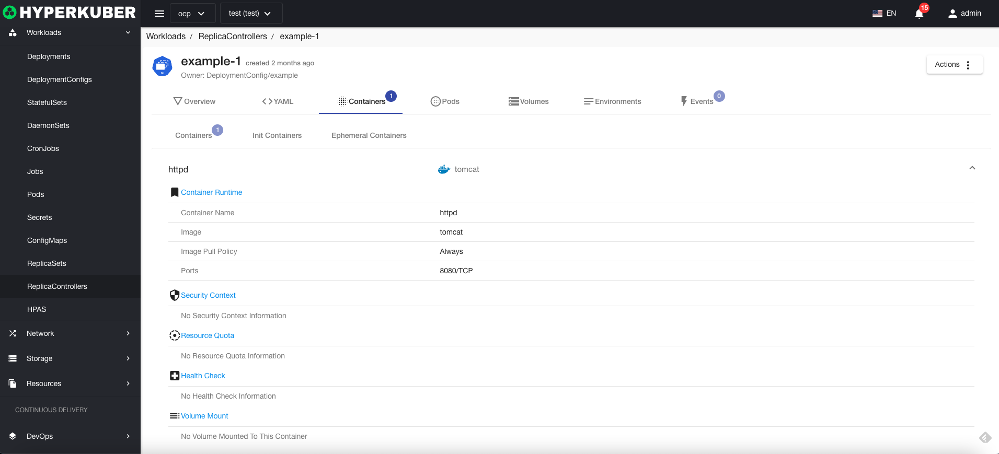
Pod information
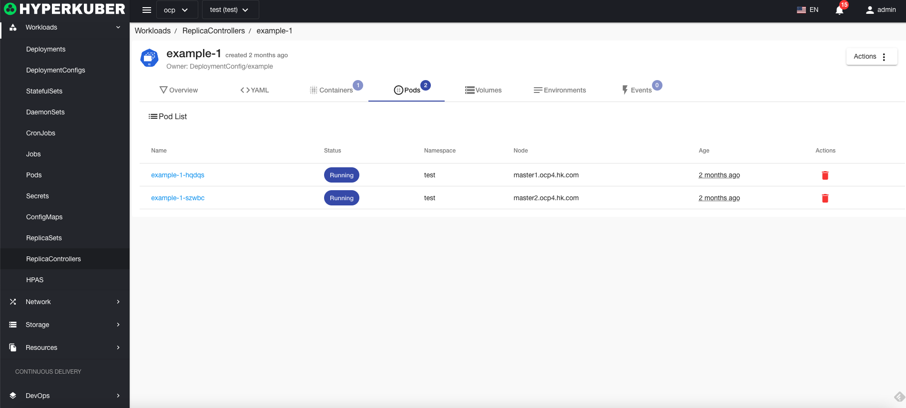
Storage volume information
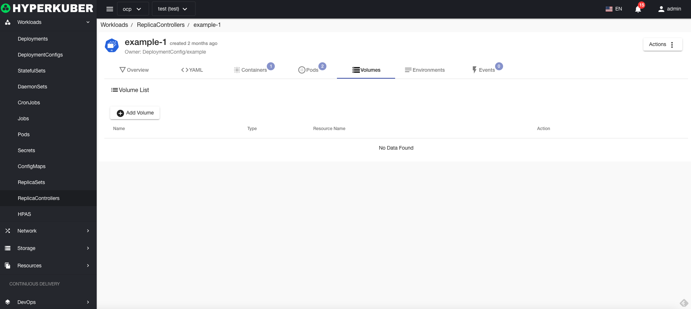
Environmental information
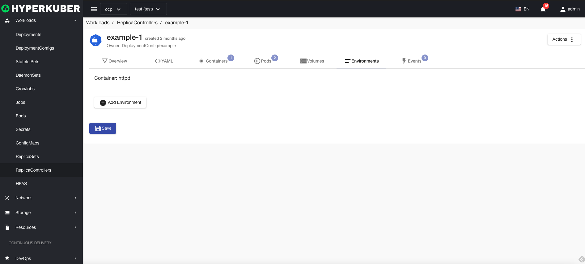
event information

### delete
Select the copy controller to be deleted, click the multi-select box to select, click the "Delete button", and enter "yes" in the confirmation input box to complete the deletion operation.
### refresh
Click "Refresh" to complete the refresh of the replica controller list.