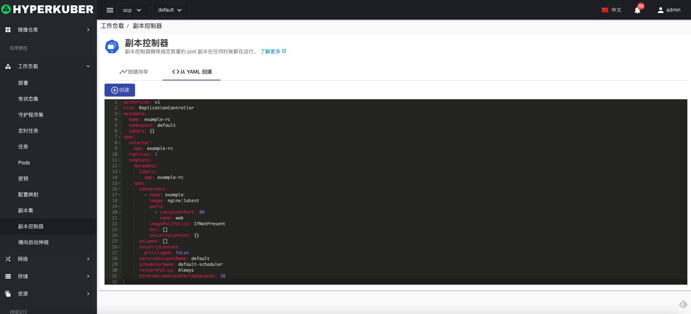

# 副本控制器

副本控制器确保指定数量的 pod 副本在任何时候都在运行。

## 副本控制器操作

支持以下界面图形化操作：
* 服务公开
* 扩容
* 其他配置
* pod网络
* 亲和性
* 容忍
* 策略
* 安全
* 标签
* 注解
* Yaml/Json编辑

### 创建
创建副本控制器，点击“创建副本控制器”按钮，进入创建副本控制器页面，填写必要参数

参数
名称：副本控制器名称

参数
镜像名称：副本控制器镜像名称
镜像地址：副本控制器镜像仓库地址
暴露端口：副本控制器服务暴露端口

非必填参数：
Pod安全
Pod网络
其他
点击“创建”即可。

### Yaml创建
副本控制器可通过Yaml文件直接创建

### 副本控制器详情
点击副本控制器名称的链接，即可进入副本控制器的详情页面
概览信息

Yaml信息

容器信息

Pod信息

存储卷信息

环境信息

事件信息

### 删除
选择需要删除的副本控制器，点击多选框选择，点击“删除按钮”，在确定输入框输入“yes”，即可完成删除操作。
### 刷新
点击“刷新”，即可完成副本控制器列表的刷新。

