# 副本集

副本集的目的是维护在任何给定时间运行的一组稳定的副本 Pod。因此，它通常用于保证指定数量的相同 Pod 的可用性。
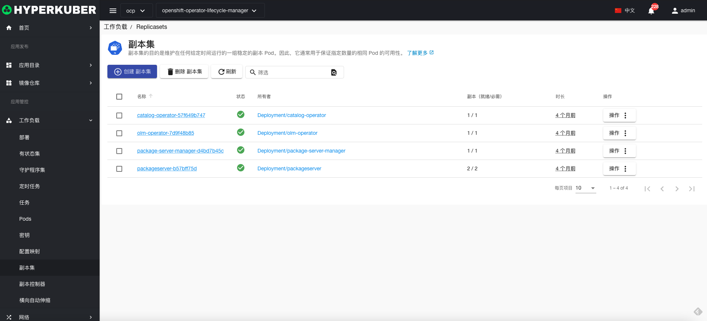
## 副本集操作

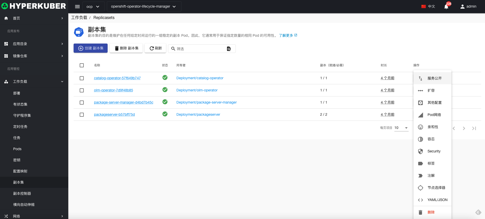
支持以下界面图形化操作：
* 服务公开
* 扩容
* 其他配置
* pod网络
* 亲和性
* 容忍
* 策略
* 安全
* 标签
* 注解
* Yaml/Json编辑

### 创建
创建副本集，点击“创建副本集”按钮，进入创建副本集页面，填写必要参数
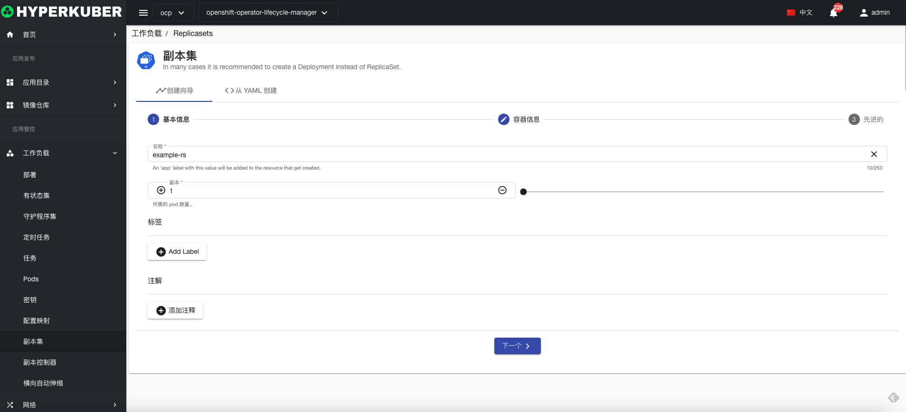
参数
名称：副本集名称

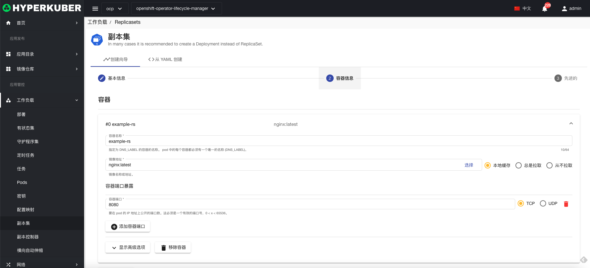
参数
镜像名称：副本集镜像名称
镜像地址：副本集镜像仓库地址
暴露端口：副本集服务暴露端口
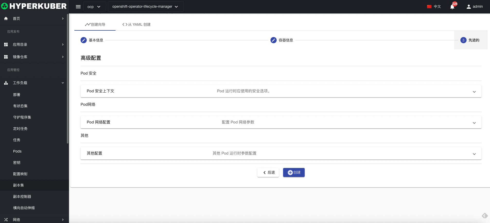
非必填参数：
Pod安全
Pod网络
其他
点击“创建”即可。

### Yaml创建
副本集可通过Yaml文件直接创建
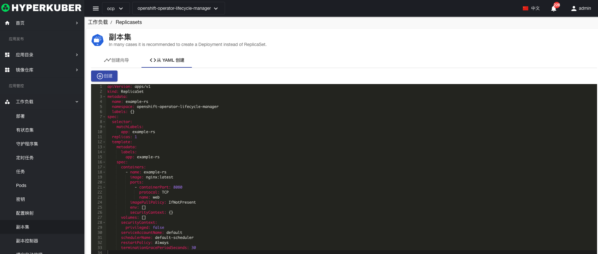
### 副本集详情
点击副本集名称的链接，即可进入副本集的详情页面
概览信息
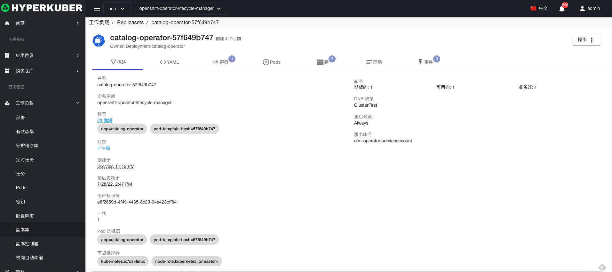

Yaml信息
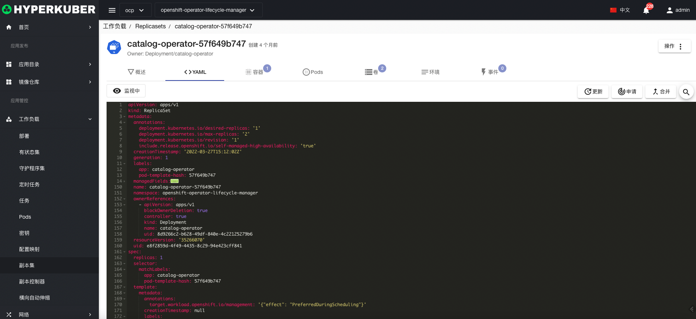
容器信息
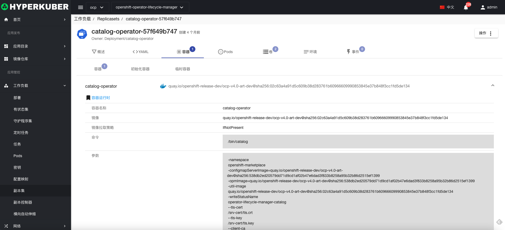
Pod信息
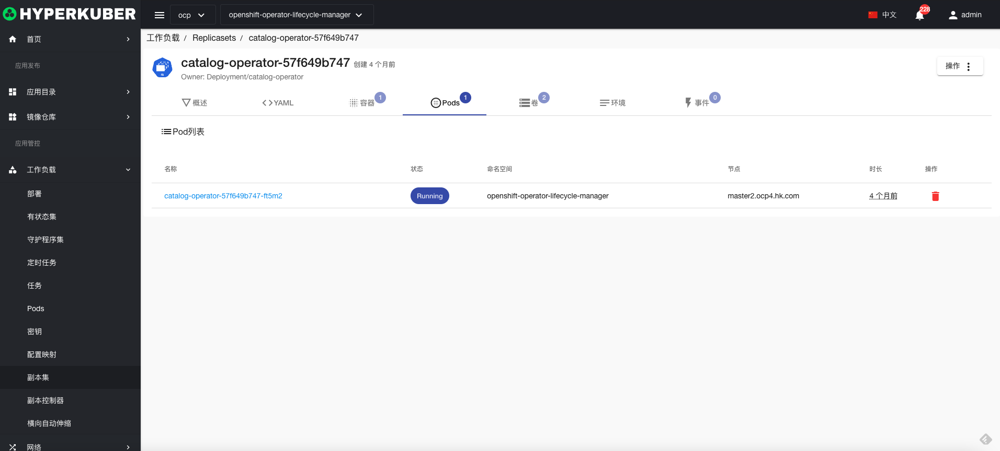
存储卷信息
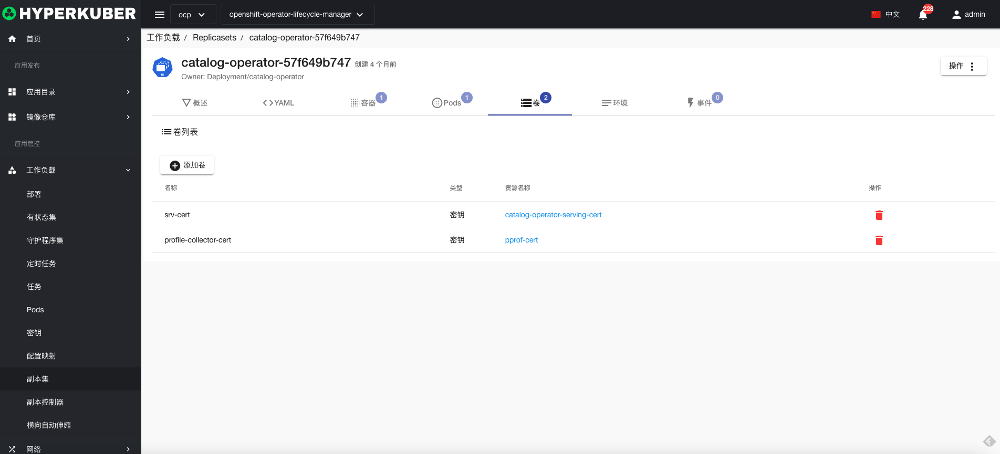
环境信息
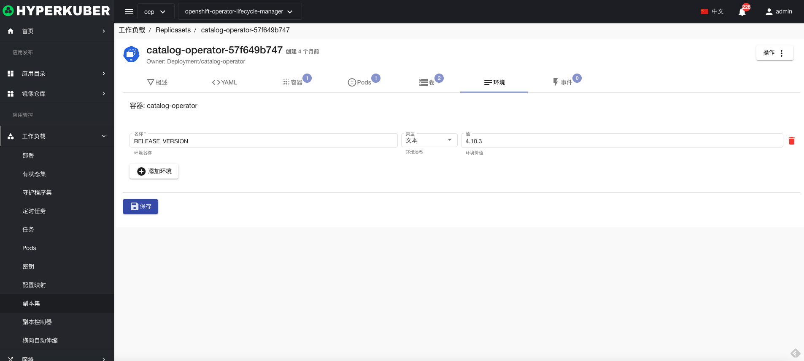
事件信息
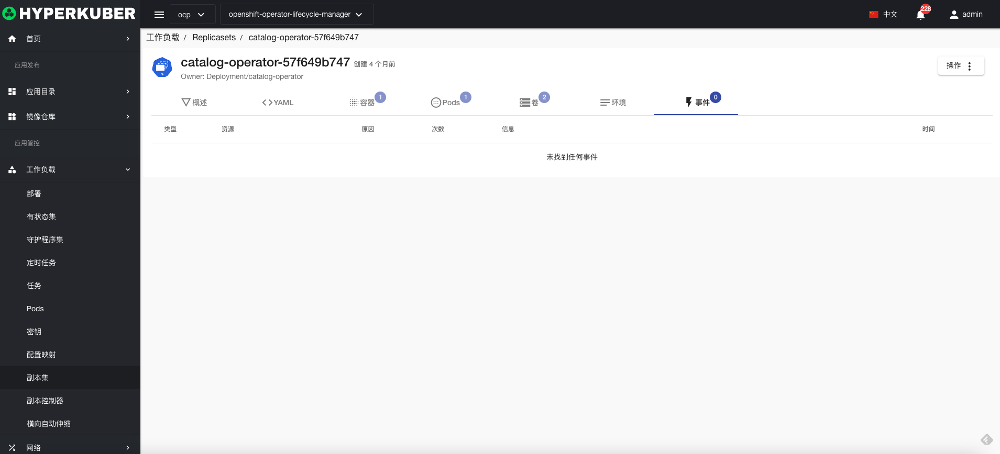

### 删除
选择需要删除的副本集，点击多选框选择，点击“删除按钮”，在确定输入框输入“yes”，即可完成删除操作。
### 刷新
点击“刷新”，即可完成副本集列表的刷新。

