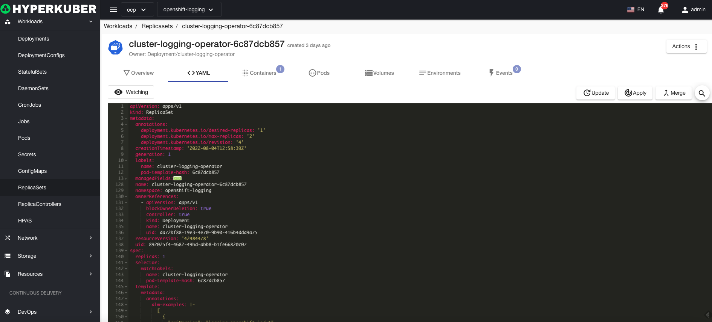

# replica set

The purpose of a replica set is to maintain a stable set of replica Pods running at any given time. Therefore, it is usually used to guarantee the availability of a specified number of identical Pods.

## Replica set operations

The following interface graphical operations are supported:
* Service public
* Expansion
* other configuration
* pod network
* Affinity
* Tolerate
* Strategy
* Safety
* Label
* Notes
* Yaml/Json editing

### Create
Create a replica set, click the "Create Replica Set" button, enter the Create Replica Set page, and fill in the necessary parameters

parameter
name: Replica set name

parameter
mirror name: the mirror name of the replica set
Mirror address: the address of the mirror warehouse of the replica set
Exposed port: Replica set service exposed port

Optional parameters:
Pod Security
Pod network
other
Click "Create" to do so.

### Yaml create
Replica sets can be created directly from Yaml files

### Replica Set Details
Click the link of the replica set name to enter the details page of the replica set
Overview information

Yaml information

container information

Pod information

Storage volume information

Environmental information

event information

### delete
Select the replica set to be deleted, click the multi-select box to select, click the "Delete button", and enter "yes" in the confirmation input box to complete the deletion operation.
### refresh
Click Refresh to complete the refresh of the replica set list.