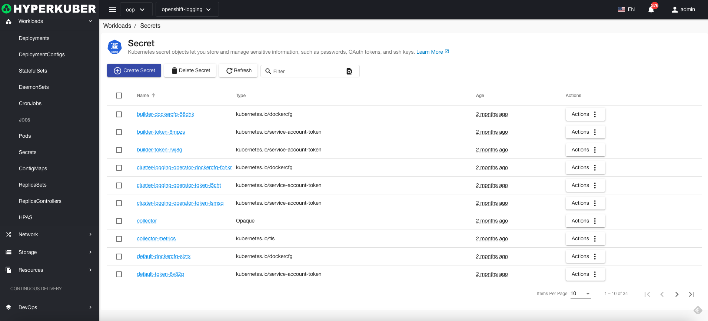
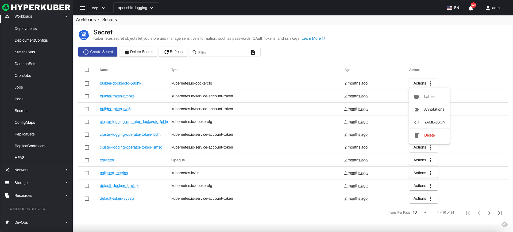
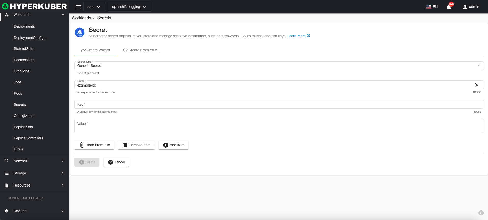
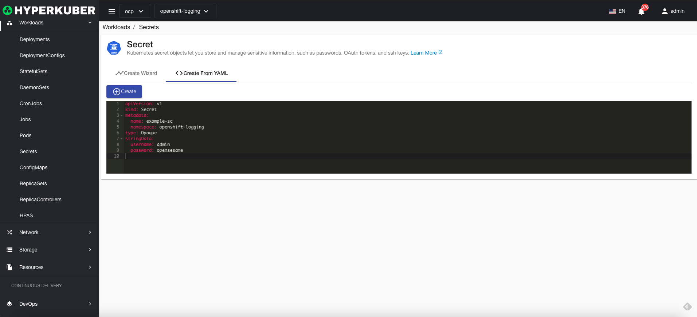
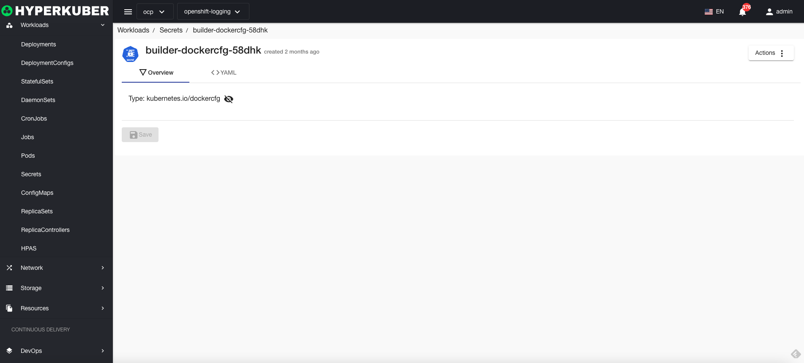
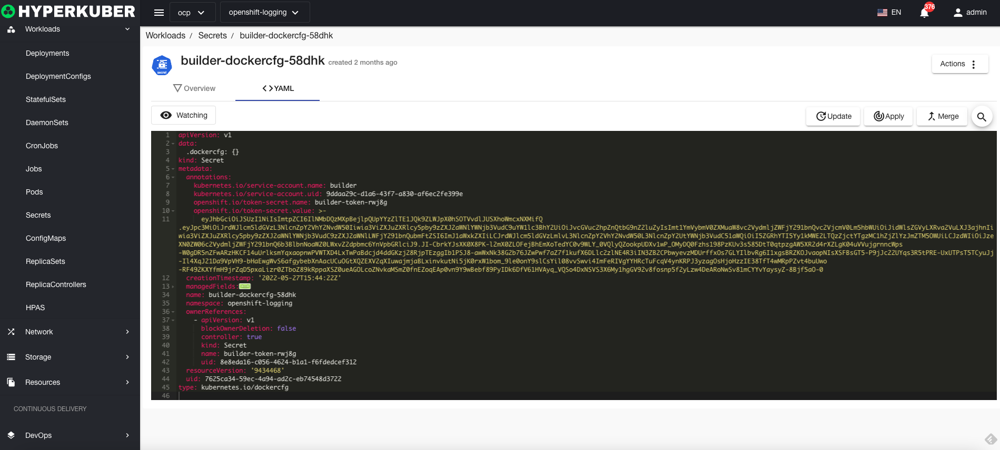

# key

Kubernetes secret objects allow you to store and manage sensitive information such as passwords, OAuth tokens, and ssh keys

## key operation

The following interface graphical operations are supported:
* Label
* Notes
* Yaml/Json editing

### Create
Create a key, click the "Create Key" button, enter the create key page, fill in the necessary parameters

parameter
Key type:
* Common key Opaque: Secret in base64 encoded format, used to store passwords and keys.
* Image key:
Serialized form of kubernetes.io/dockercfg ~/.dockercfg file
Serialized form of kubernetes.io/dockerconfigjson ~/.docker/config.json file
* Source key:
kubernetes.io/service-account-token service account token
kubernetes.io/basic-auth Credentials for Basic Authentication
kubernetes.io/ssh-auth Credentials for SSH authentication
kubernetes.io/tls for TLS client or server data
* WebHook key:
bootstrap.kubernetes.io/token bootstrap token data
name: key name
key: the key in the key
Value: Value in the key

### Yaml create
Keys can be created directly from a Yaml file

### key details
Click the link of the key name to enter the details page of the key
Overview information

Yaml information

### delete
Select the key to be deleted, click the multi-select box to select, click the "Delete button", and enter "yes" in the confirmation input box to complete the deletion operation.
### refresh
Click "Refresh" to refresh the key list.