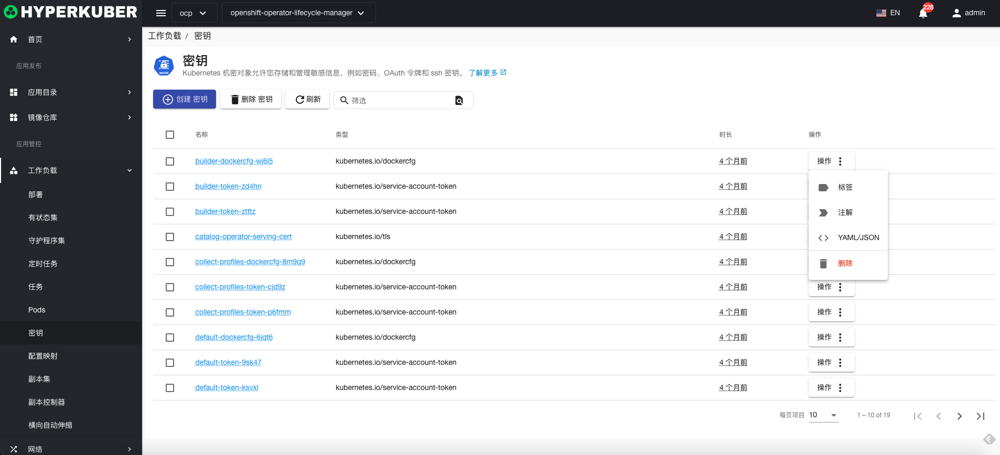
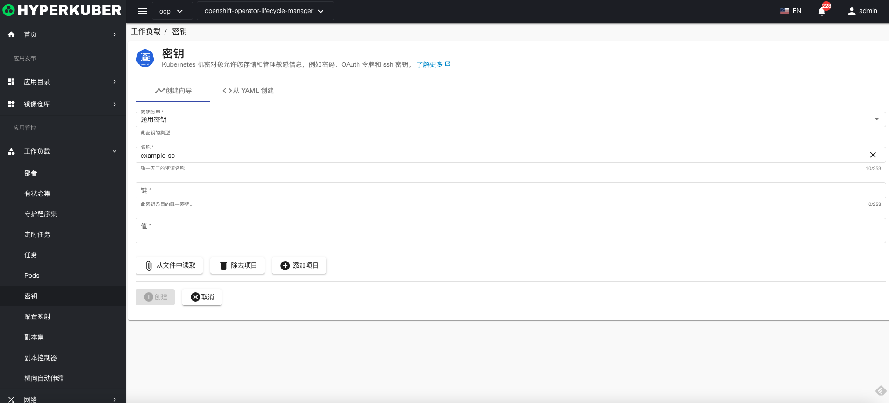
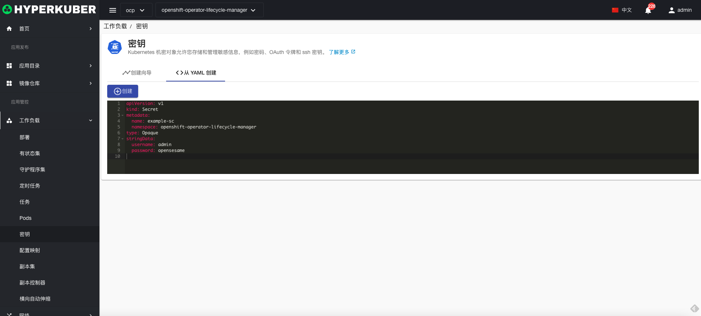
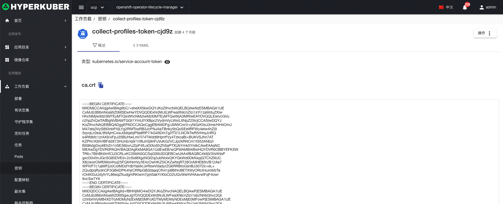
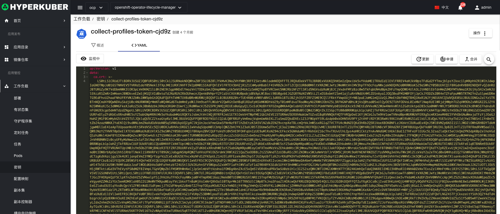

# 密钥

Kubernetes 机密对象允许您存储和管理敏感信息，例如密码、OAuth 令牌和 ssh 密钥

## 密钥操作

支持以下界面图形化操作：
* 标签
* 注解
* Yaml/Json编辑

### 创建
创建密钥，点击“创建密钥”按钮，进入创建密钥页面，填写必要参数

参数
密钥类型：
* 通用密钥 Opaque：base64 编码格式的 Secret，用来存储密码、密钥。
* 镜像密钥：
kubernetes.io/dockercfg	~/.dockercfg 文件的序列化形式
kubernetes.io/dockerconfigjson	~/.docker/config.json 文件的序列化形式
* 来源密钥：
kubernetes.io/service-account-token	服务账号令牌
kubernetes.io/basic-auth	用于基本身份认证的凭据
kubernetes.io/ssh-auth	用于 SSH 身份认证的凭据
kubernetes.io/tls	用于 TLS 客户端或者服务器端的数据
* WebHook密钥：
bootstrap.kubernetes.io/token	启动引导令牌数据
名称：密钥名称
键：密钥中的Key
值：密钥中的Value

### Yaml创建
密钥可通过Yaml文件直接创建

### 密钥详情
点击密钥名称的链接，即可进入密钥的详情页面
概览信息

Yaml信息

### 删除
选择需要删除的密钥，点击多选框选择，点击“删除按钮”，在确定输入框输入“yes”，即可完成删除操作。
### 刷新
点击“刷新”，即可完成密钥列表的刷新。

