# stateful set

Similar to Deployment, StatefulSet manages a set of Pods based on the same container specification. But unlike Deployments, StatefulSets maintain a sticky ID for each of their Pods. These Pods are created based on the same specification, but are not interchangeable: no matter how they are scheduled, each Pod has a permanent ID.

## Stateful set operations

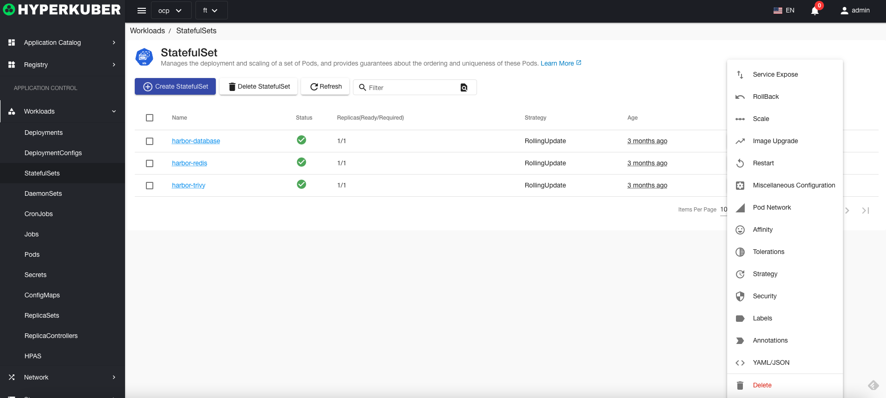
The following interface graphical operations are supported:
* Service public
* rollback
* Expansion
* Image upgrade
* reboot
* other configuration
* pod network
* Affinity
* Tolerate
* Strategy
* Safety
* Label
* Notes
* Yaml/Json editing

### Create
Create a stateful set, click the "Create stateful set" button, enter the create stateful set page, fill in the necessary parameters
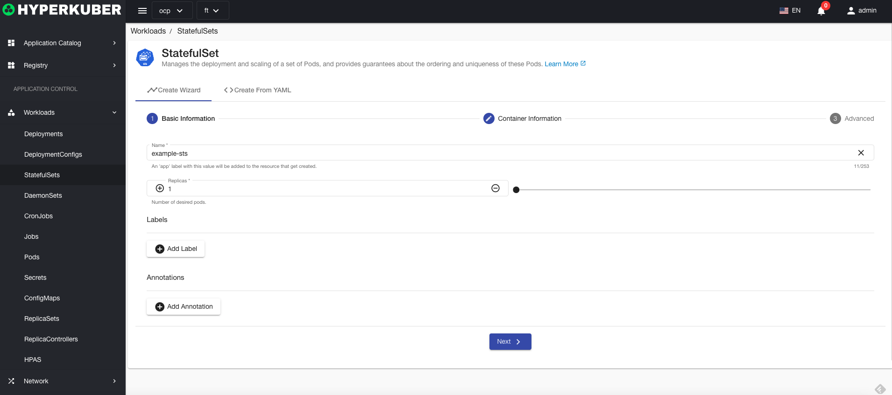
parameter
name: stateful set name
Number of Replicas: Stateful Sets control the number of replicas of a Pod
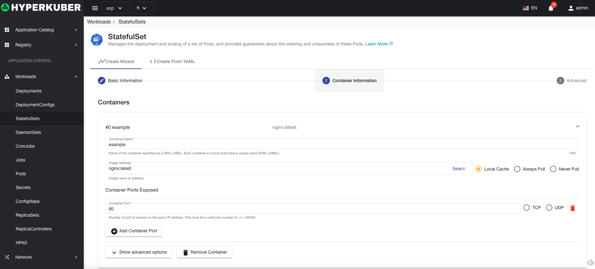
parameter
mirror name: stateful set mirror name
Mirror address: Stateful set mirror warehouse address
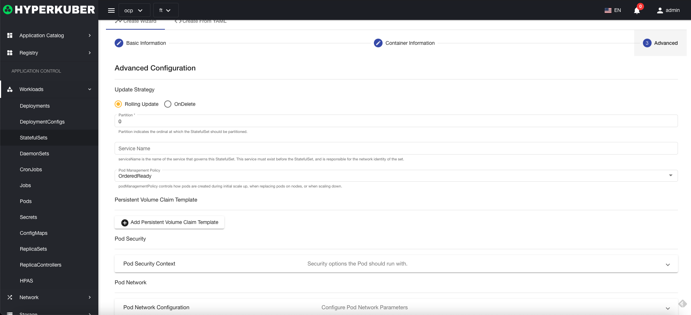
parameter
Update strategy: stateful set mirror rolling upgrade strategy
Click "Create" to do so.
### Stateful set details
Click the link of the stateful set name to enter the stateful set details page
Overview information
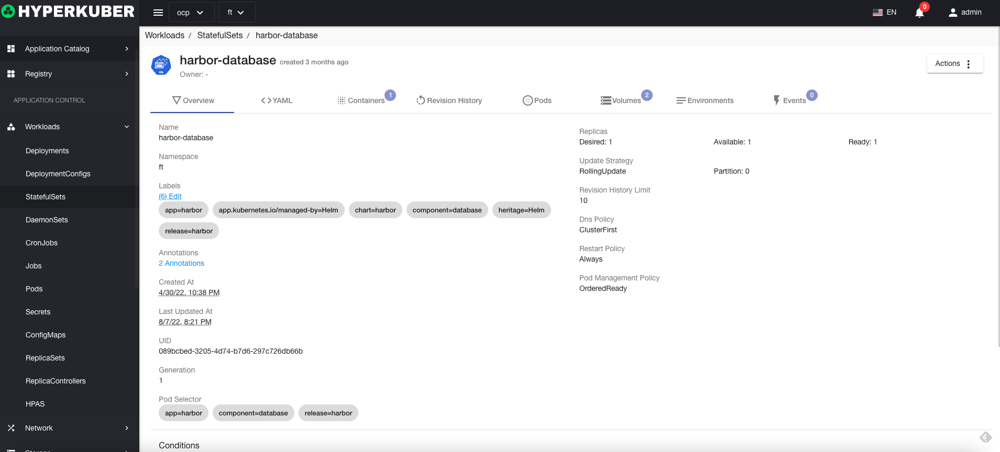

Yaml information
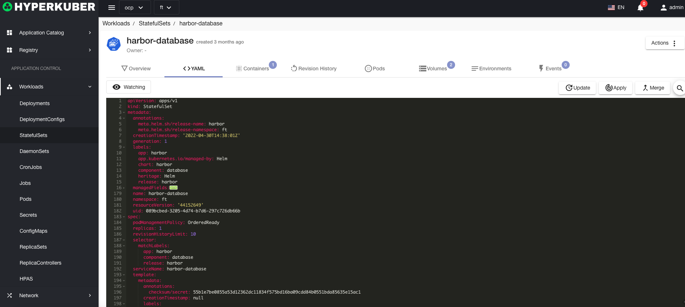
container information
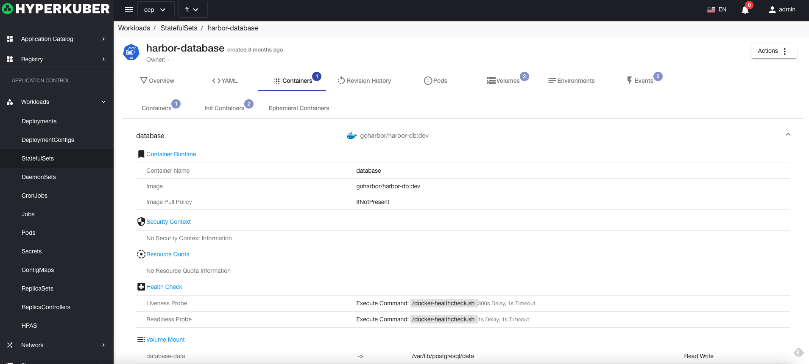
Revision log information
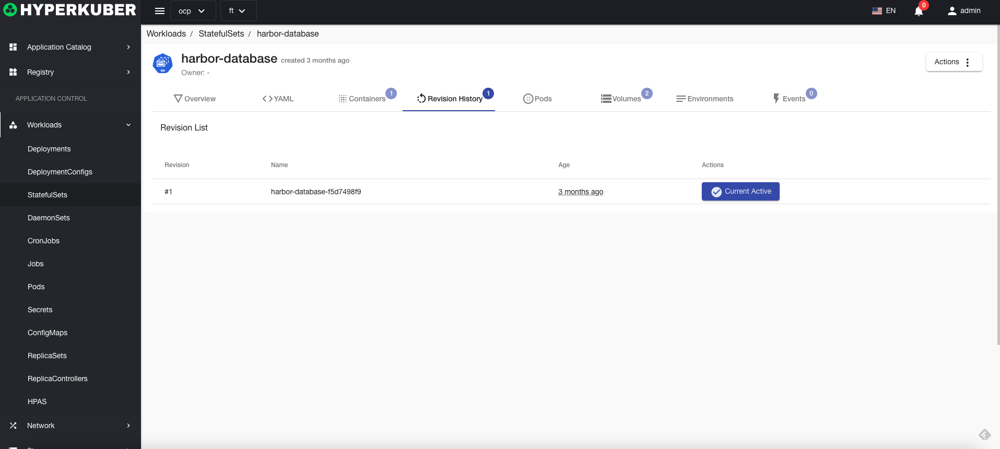
Pod information
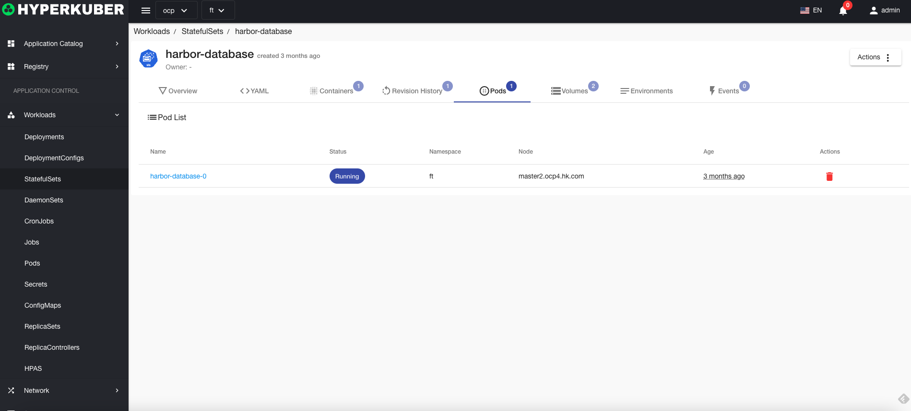
Storage volume information
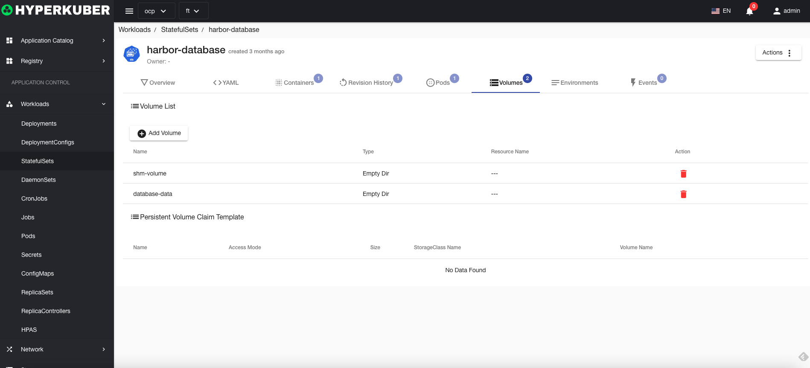
Environmental information
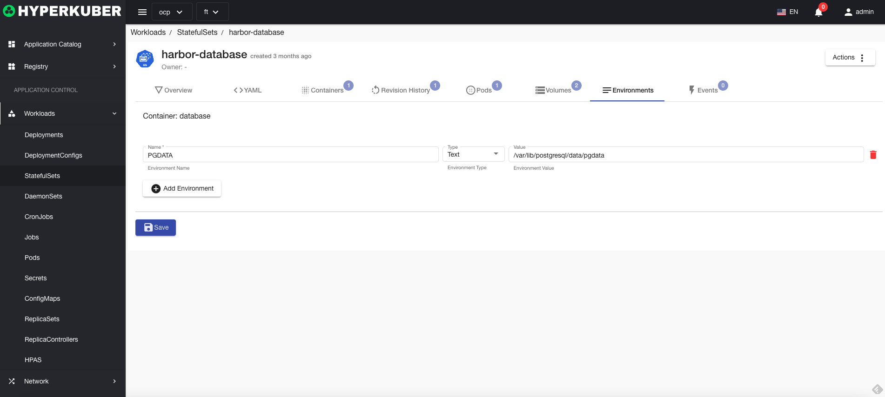
event information

### delete
Select the stateful set to be deleted, click the multi-select box to select, click the "Delete button", and enter "yes" in the confirmation input box to complete the deletion operation.
### refresh
Click "Refresh" to complete the refresh of the list of stateful sets.