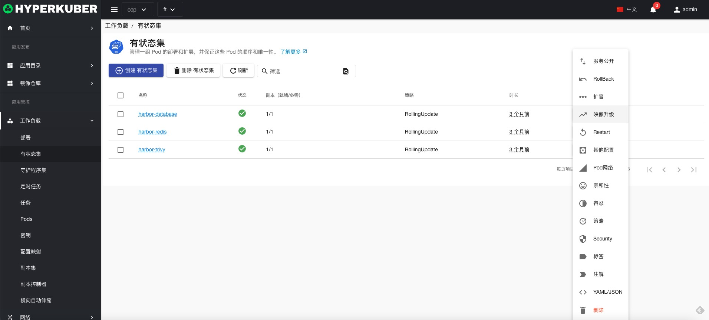
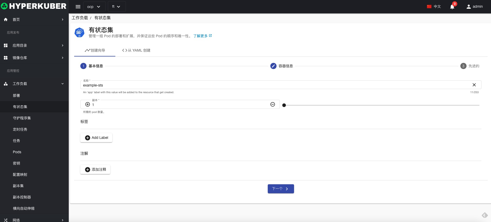
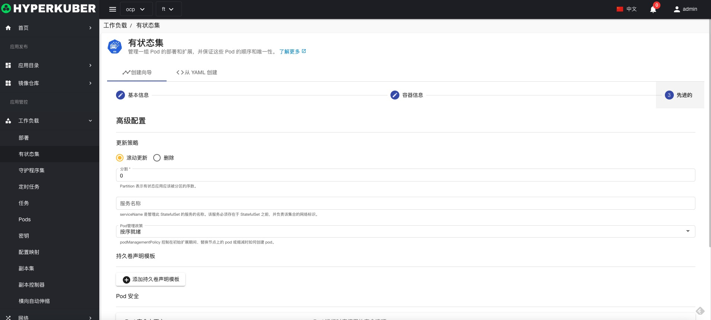
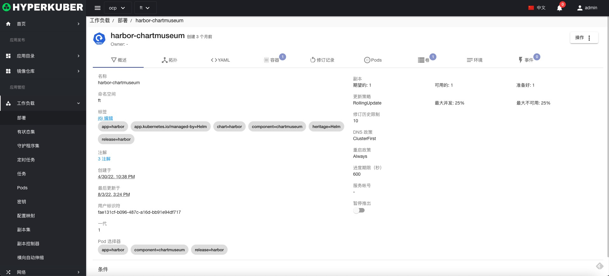

# 有状态集

StatefulSets 是常用Workload的一种，和 Deployment 类似， StatefulSet 管理基于相同容器规约的一组 Pod。但和 Deployment 不同的是， StatefulSet 为它们的每个 Pod 维护了一个有粘性的 ID。这些 Pod 是基于相同的规约来创建的， 但是不能相互替换：无论怎么调度，每个 Pod 都有一个永久不变的 ID。

## 有状态集操作

支持以下界面图形化操作：
* 暂停滚动更新
* 服务公开
* 扩容
* 重启
* 镜像升级
* 回滚
* 其他配置
* pod网络
* 亲和性
* 容忍
* 策略
* 安全
* 标签
* 注解
* Yaml/Json编辑

### 创建
创建有状态集，点击“创建有状态集”按钮，进入创建有状态集页面，填写必要参数

参数
名称：有状态集名称
副本数：有状态集控制Pod的副本数量

参数
镜像名称：有状态集镜像名称
镜像地址：有状态集镜像仓库地址

参数
更新策略：有状态集镜像滚动升级策略
点击“创建”即可。
### 有状态集详情
点击有状态集名称的链接，即可进入有状态集的详情页面
概览信息

**其他信息与部署Tab页签相同**
Yaml信息

容器信息

修订记录信息

Pod信息

存储卷信息

环境信息

事件信息

### 删除
选择需要删除的有状态集，点击多选框选择，点击“删除按钮”，在确定输入框输入“yes”，即可完成删除操作。
### 刷新
点击“刷新”，即可完成有状态集列表的刷新。

